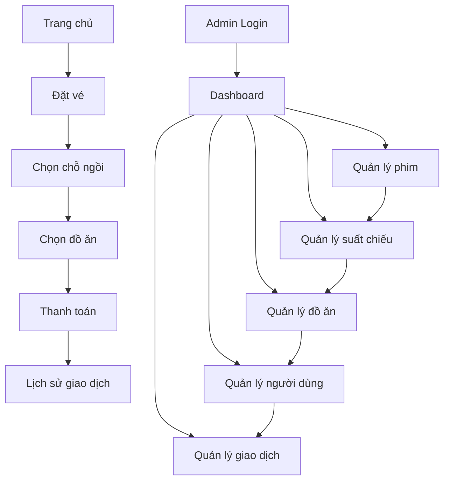

## 1. Product Overview
Hệ thống quản lý rạp chiếu phim cho phép người dùng đặt vé xem phim và quản trị viên quản lý toàn bộ hoạt động của rạp. Hệ thống giải quyết vấn đề quản lý phức tạp của rạp chiếu phim thông qua giao diện web thân thiện.

Sản phẩm hướng đến chủ rạp chiếu phim và khách hàng, giúp tối ưu hóa quy trình bán vé và quản lý rạp hiệu quả.

## 2. Core Features

### 2.1 User Roles
| Role | Registration Method | Core Permissions |
|------|---------------------|------------------|
| Khách hàng | Email/SĐT đăng ký | Xem lịch chiếu, đặt vé, xem lịch sử giao dịch |
| Quản trị viên | Tạo bởi chủ rạp | Quản lý toàn bộ hệ thống: phim, suất chiếu, đồ ăn, người dùng, giao dịch |

### 2.2 Feature Module
Hệ thống quản lý rạp chiếu phim gồm các trang chính:

**Trang khách hàng:**
1. **Trang chủ**: Hiển thị phim đang chiếu, phim sắp chiếu, lịch chiếu nổi bật.
2. **Trang đặt vé**: Chọn phim, suất chiếu, chỗ ngồi, đồ ăn kèm.
3. **Trang thanh toán**: Xác nhận đơn hàng, chọn phương thức thanh toán.
4. **Trang lịch sử giao dịch**: Xem lại các giao dịch đã thực hiện.
5. **Trang đăng nhập/đăng ký**: Xác thực người dùng.

**Trang quản trị (Admin):**
1. **Dashboard**: Tổng quan thống kê doanh thu, số lượng vé bán ra.
2. **Quản lý phim**: CRUD phim, cập nhật lịch chiếu.
3. **Quản lý suất chiếu**: Tạo và điều chỉnh suất chiếu cho từng phòng.
4. **Quản lý đồ ăn**: Quản lý menu đồ ăn, giá cả, tồn kho.
5. **Quản lý người dùng**: Xem và quản lý tài khoản khách hàng.
6. **Quản lý giao dịch**: Theo dõi tất cả giao dịch trong hệ thống.

### 2.3 Page Details
| Page Name | Module Name | Feature description |
|-----------|-------------|---------------------|
| Trang chủ | Hero section | Hiển thị banner phim nổi bật tự động chuyển đổi. |
| Trang chủ | Danh sách phim | Hiển thị phim đang chiếu và sắp chiếu theo dạng lưới. |
| Trang chủ | Lịch chiếu nhanh | Xem suất chiếu trong ngày của từng phim. |
| Đặt vé | Chọn phim | Xem thông tin phim, trailer, đánh giá. |
| Đặt vé | Chọn suất chiếu | Chọn ngày, giờ chiếu và phòng chiếu. |
| Đặt vé | Chọn chỗ ngồi | Giao diện sơ đồ ghế, chọn và đánh dấu ghế đã chọn. |
| Đặt vé | Chọn đồ ăn | Thêm đồ ăn, nước uống vào đơn hàng. |
| Thanh toán | Xác nhận đơn | Hiển thị chi tiết đơn hàng, tổng tiền. |
| Thanh toán | Phương thức thanh toán | Chọn thanh toán online hoặc tại quầy. |
| Lịch sử giao dịch | Danh sách giao dịch | Hiển thị các giao dịch theo thời gian. |
| Lịch sử giao dịch | Chi tiết giao dịch | Xem chi tiết vé, đồ ăn, tổng tiền. |
| Admin Dashboard | Thống kê tổng quan | Hiển thị doanh thu theo ngày/tháng, số vé bán ra. |
| Admin Dashboard | Biểu đồ | Biểu đồ doanh thu, số lượng vé bán theo thời gian. |
| Quản lý phim | Danh sách phim | Hiển thị phim với bộ lọc theo thể loại, trạng thái. |
| Quản lý phim | Thêm/sửa phim | Form nhập thông tin phim, upload poster, trailer. |
| Quản lý phim | Cập nhật lịch chiếu | Thêm suất chiếu cho phim vào từng phòng. |
| Quản lý suất chiếu | Lịch chiếu theo phòng | Xem suất chiếu theo từng phòng, ngày. |
| Quản lý suất chiếu | Điều chỉnh suất chiếu | Thay đổi giờ chiếu, phòng chiếu, trạng thái. |
| Quản lý đồ ăn | Danh mục đồ ăn | Hiển thị menu đồ ăn theo loại. |
| Quản lý đồ ăn | Thêm/sửa món ăn | Form nhập tên, giá, mô tả, hình ảnh. |
| Quản lý đồ ăn | Quản lý tồn kho | Cập nhật số lượng tồn kho từng món. |
| Quản lý người dùng | Danh sách khách hàng | Hiển thị thông tin khách hàng, lịch sử mua vé. |
| Quản lý người dùng | Tìm kiếm | Tìm kiếm khách hàng theo tên, SĐT, email. |
| Quản lý giao dịch | Danh sách giao dịch | Hiển thị tất cả giao dịch với bộ lọc theo ngày. |
| Quản lý giao dịch | Chi tiết giao dịch | Xem chi tiết vé, đồ ăn, khách hàng, tổng tiền. |

## 3. Core Process

**Luồng khách hàng:**
Người dùng truy cập trang chủ → Xem phim và lịch chiếu → Chọn phim và suất chiếu → Chọn chỗ ngồi → Chọn đồ ăn (nếu cần) → Thanh toán → Nhận vé điện tử → Xem lại trong lịch sử giao dịch.

**Luồng quản trị viên:**
Admin đăng nhập → Vào dashboard xem thống kê → Quản lý phim (thêm, sửa, xóa) → Cập nhật lịch chiếu → Quản lý đồ ăn → Theo dõi giao dịch → Quản lý khách hàng.

## 4. User Interface Design

### 4.1 Design Style
- **Màu chủ đạo**: Đỏ (#E50914) và đen (#141414) - màu truyền thống của rạp chiếu phim
- **Màu phụ**: Trắng (#FFFFFF) và xám (#808080)
- **Button style**: Rounded corners với hiệu ứng hover, shadow nhẹ
- **Font**: Roboto và Arial, kích thước 14-16px cho nội dung, 18-24px cho tiêu đề
- **Layout**: Card-based layout với grid system,