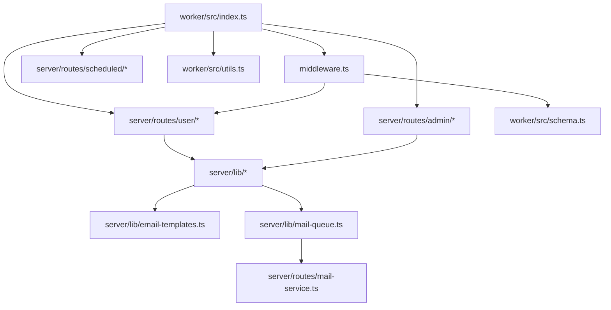
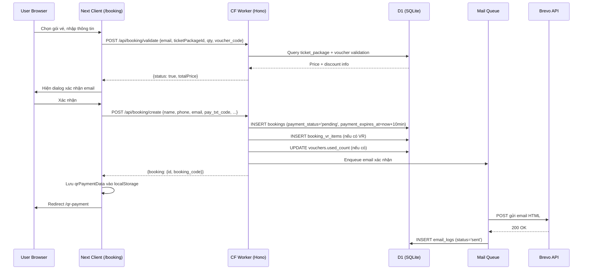
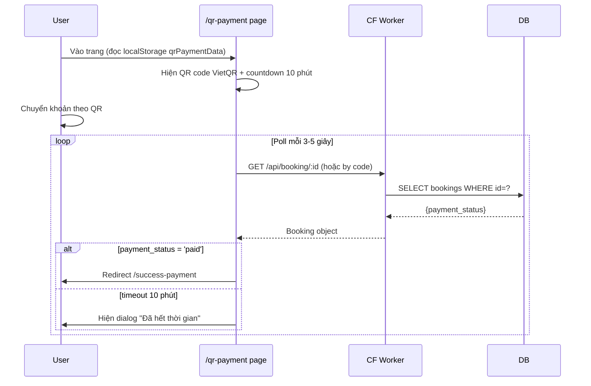
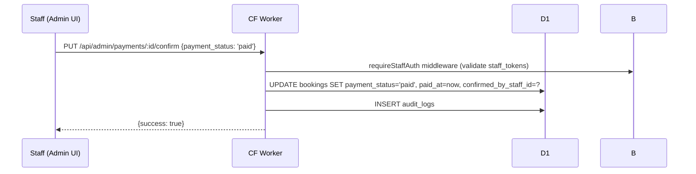
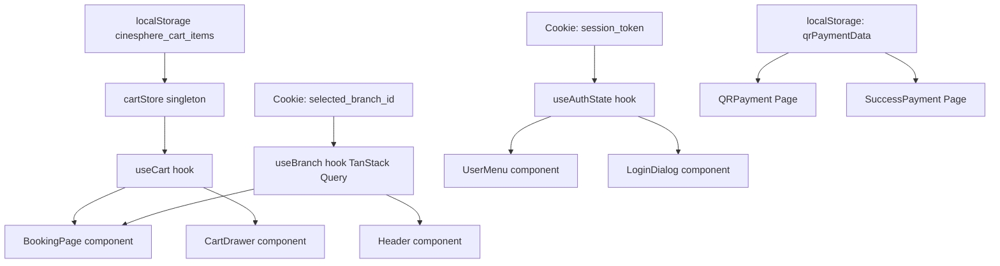
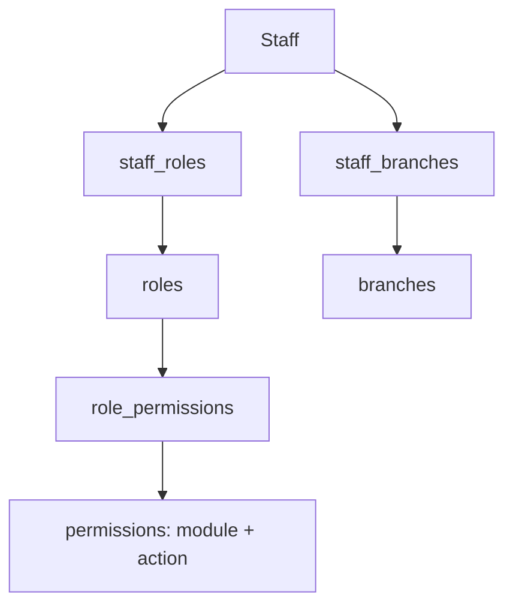
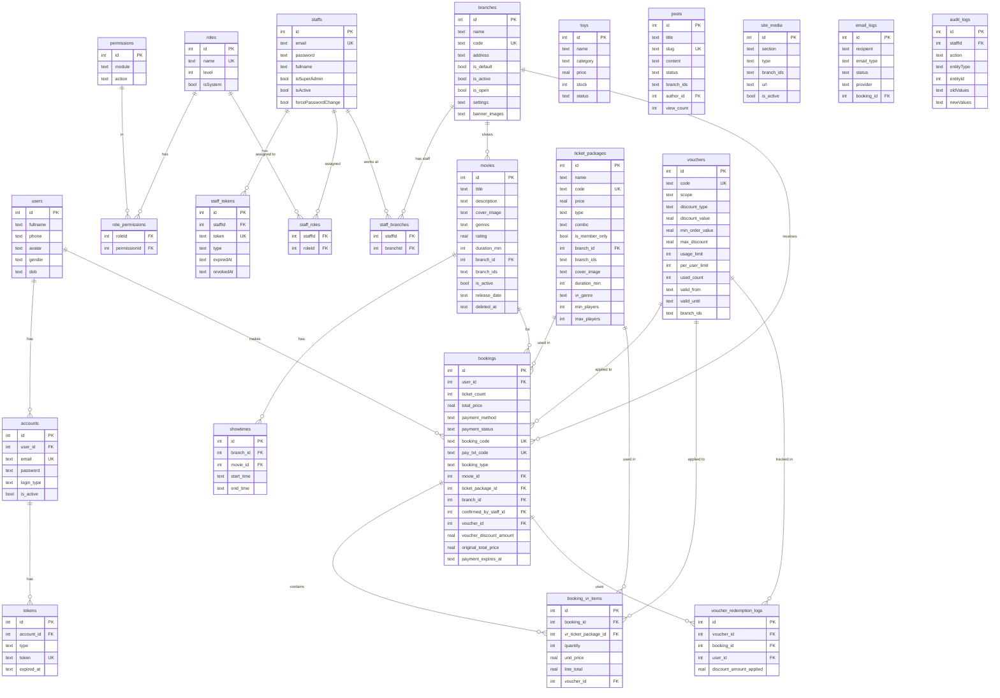

# PROJECT OVERVIEW: CTBooking / Cinesphere

> **Mục đích tài liệu:** Mô tả toàn bộ hệ thống để AI khác review kiến trúc và đề xuất cải tiến.  
> **Viết bởi:** Senior Software Architect (AI-assisted analysis)  
> **Ngày phân tích:** 2026-09-14  

---

## 1. Tổng quan dự án

### 1.1 Mục đích & Đối tượng

**Cinesphere** là nền tảng đặt vé xem phim và trải nghiệm thực tế ảo (VR) trực tuyến dành cho:
- **Người dùng cuối:** Đặt vé xem phim 8K, gói VR 9D, mua combo, áp mã giảm giá, thanh toán VietQR.
- **Nhân viên/Admin:** Quản lý phim, suất chiếu, vé, doanh thu, chi nhánh, nhân viên (RBAC), voucher.

**Phạm vi chức năng chính:**
- Đặt vé phim + VR (đơn lẻ hoặc combo)
- Thanh toán VietQR (chuyển khoản ngân hàng) tích hợp webhook SePay đối soát tự động, MoMo, VNPay (cấu hình sẵn).
- Xác thực người dùng (bảo vệ bằng Cloudflare Turnstile chống Bot): Email/Password + OTP 2FA tùy chọn
- Quản lý đa chi nhánh (multi-branch) với lọc nội dung theo chi nhánh
- Hệ thống RBAC cho staff (roles, permissions, branch assignment)
- Blog/bài viết SEO
- Admin dashboard với revenue analytics (fix lỗi hydration/DOM)
- Email tự động (booking confirm, welcome, reset password, OTP)

### 1.2 Tech Stack

| Layer | Technology | Version |
|-------|-----------|---------|
| **Frontend (User)** | Next.js (App Router) | ~14 (edge runtime) |
| **Frontend (Admin)** | React + Vite SPA | React 18.3 |
| **Backend API** | Cloudflare Workers + Hono | Hono 4.11.1 |
| **Database** | Cloudflare D1 (SQLite) | - |
| **ORM** | Drizzle ORM | 0.45.1 |
| **Styling** | Tailwind CSS v3 | 3.4.17 |
| **UI Components** | shadcn/ui (Radix UI) | - |
| **State Management** | TanStack Query v5 + Custom Store | 5.84.2 |
| **Email** | Brevo (Sendinblue) API | - |
| **Media/CDN** | Cloudflare R2 + Cloudinary | - |
| **Build Tool (Admin)** | Vite | 7.1.2 |
| **Build Tool (Next)** | Next.js built-in + wrangler Pages | - |
| **Runtime** | Cloudflare Workers (edge) | - |
| **Package Manager** | pnpm | 10.14.0 |
| **Language** | TypeScript | 5.9.2 |
| **Cron** | Cloudflare Workers Cron Trigger | mỗi 5 phút |
| **Rate Limiting** | Cloudflare KV | - |
| **3D/VR Preview** | Three.js + @react-three/fiber | 0.176.0 |
| **Form** | react-hook-form + zod | 7.62.0 / 3.25 |
| **HTTP Client** | fetch (native) | - |
| **Animation** | Framer Motion | 12.23.26 |

### 1.3 Các Package Quan Trọng

```json
{
  "hono": "^4.11.1",
  "drizzle-orm": "^0.45.1",
  "drizzle-kit": "^0.31.8",
  "wrangler": "^4.124.0",
  "zod": "^3.25.76",
  "react": "^18.3.1",
  "@tanstack/react-query": "^5.84.2",
  "tailwindcss": "^3.4.17",
  "framer-motion": "^12.23.26",
  "bcryptjs": "^3.0.3",
  "sonner": "^1.7.4",
  "resend": "^6.6.0",
  "cloudinary": "^2.8.0",
  "lucide-react": "^0.539.0",
  "antd": "^6.0.0"
}
```

---

## 2. Cấu trúc thư mục

### 2.1 Cây thư mục (tree)

```
CTBooking/                          ← Monorepo root
├── .env                            ← Biến môi trường local (không commit)
├── .env.preview                    ← Biến môi trường preview
├── package.json                    ← Root scripts: dev, build, deploy, db
├── pnpm-workspace.yaml             ← Khai báo workspace monorepo
├── wrangler.toml                   ← Cấu hình root (legacy, ít dùng)
│
├── worker/                         ← ⭐ BACKEND CHÍNH: Cloudflare Worker
│   ├── wrangler.toml               ← Cấu hình Worker: D1, KV, R2, cron, envs
│   ├── migrations/                 ← SQL migration files (0001 → 0015+)
│   └── src/
│       ├── index.ts                ← ⭐ Entry point: toàn bộ API routes (5505 dòng!)
│       ├── schema.ts               ← Drizzle schema: 18 bảng SQLite
│       ├── middleware.ts           ← requireAuth, requireStaffAuth, requirePermission, rateLimiter
│       └── utils.ts               ← Helpers: Cloudinary, cache, token, date utils
│
├── server/                         ← Business logic (imported bởi worker)
│   ├── cloudinary.ts               ← Cloudinary integration (Express version)
│   └── lib/                        ← Shared utilities
│   │   ├── audit-logger.ts         ← Ghi audit log cho staff actions
│   │   ├── branch-guard.ts         ← Guard: giới hạn staff theo chi nhánh
│   │   ├── branch-ids.ts           ← Helpers xử lý branch_ids JSON
│   │   ├── email-templates.ts      ← ⭐ Single source of truth cho email HTML
│   │   ├── mail-queue.ts           ← Queue gửi mail bất đồng bộ
│   │   ├── otp-utils.ts            ← Generate/validate/delete OTP
│   │   ├── rbac-seed.ts            ← Seed dữ liệu roles & permissions
│   │   └── staff-auth.ts           ← Load staff permissions từ DB
│   └── routes/
│       ├── mail-service.ts         ← Adapter gửi mail qua Brevo API
│       ├── admin/                  ← 20 files route admin
│       │   ├── branches.ts         ← CRUD chi nhánh
│       │   ├── dashboard.ts        ← Revenue metrics, charts
│       │   ├── movies.ts           ← CRUD phim + soft delete
│       │   ├── payments.ts         ← Xem/tìm giao dịch admin
│       │   ├── tickets.ts          ← CRUD gói vé
│       │   ├── showtimes.ts        ← CRUD suất chiếu
│       │   ├── staff-auth.ts       ← Login/logout cho staff
│       │   ├── staff-management.ts ← CRUD nhân viên + RBAC
│       │   ├── vouchers.ts         ← CRUD voucher/mã giảm giá
│       │   ├── posts.ts            ← CRUD bài viết blog
│       │   ├── roles.ts            ← CRUD roles & permissions
│       │   ├── users.ts            ← Xem danh sách user (admin)
│       │   ├── site-media.ts       ← Quản lý banner/video trang chủ
│       │   ├── toys.ts             ← CRUD sản phẩm phụ
│       │   ├── email-logs.ts       ← Xem log email đã gửi
│       │   ├── setup.ts            ← Setup superadmin lần đầu
│       │   └── audit-utils.ts      ← Wrapper ghi audit log
│       ├── user/                   ← 11 files route user
│       │   ├── auth.ts             ← Login, register, OTP validate/resend
│       │   ├── password.ts         ← Forget/reset/change password
│       │   ├── payments.ts         ← ⭐ Validate + Create booking (55KB)
│       │   ├── movies.ts           ← Public movie list
│       │   ├── tickets.ts          ← Public ticket packages
│       │   ├── users.ts            ← User profile, transactions
│       │   ├── vouchers.ts         ← Validate voucher cho VR/movie
│       │   ├── vr-bookings.ts      ← VR booking validate + create
│       │   ├── showtimes.ts        ← Public showtime schedule
│       │   └── toys.ts             ← Public toy/product list
│       └── scheduled/
│           └── booking-expiry.ts   ← Cron: expire booking quá hạn
│
├── next-client/                    ← ⭐ FRONTEND CHO NGƯỜI DÙNG: Next.js
│   ├── next.config.mjs             ← Config: edge runtime, rewrites đến worker
│   ├── wrangler.toml               ← Deploy lên Cloudflare Pages
│   └── src/
│       ├── app/                    ← Next.js App Router pages
│       │   ├── layout.tsx          ← Root layout: font, metadata, providers
│       │   ├── page.tsx            ← Trang chủ (SSR + ISR 5 phút)
│       │   ├── booking/page.tsx    ← ⭐ Trang đặt vé (1283 dòng, client)
│       │   ├── qr-payment/         ← Trang thanh toán QR
│       │   ├── checkout/           ← Trang sau thanh toán (MoMo/VNPay return)
│       │   ├── success-payment/    ← Xác nhận thanh toán thành công
│       │   ├── account/            ← Trang tài khoản: profile, lịch sử
│       │   ├── vr/                 ← Giới thiệu VR (3D showcase)
│       │   ├── vr-booking/         ← Booking VR riêng
│       │   ├── bai-viet/           ← Blog / bài viết
│       │   ├── reset-password/     ← Trang đặt lại mật khẩu
│       │   └── maintenance/        ← Trang bảo trì
│       ├── components/             ← UI components
│       │   ├── LoginDialog.tsx     ← Modal đăng nhập
│       │   ├── RegisterDialog.tsx  ← Modal đăng ký
│       │   ├── OTPDialog.tsx       ← Modal nhập OTP 2FA
│       │   ├── UserMenu.tsx        ← Dropdown menu user
│       │   ├── MovieSchedulePanel.tsx ← Panel lịch chiếu
│       │   └── user/               ← Components theo section trang chủ
│       ├── store/
│       │   ├── cartStore.ts        ← ⭐ Custom store: localStorage + pub/sub
│       │   └── movieStore.ts       ← Store phim đang xem
│       ├── hooks/
│       │   ├── useBranch.ts        ← Hook chọn chi nhánh + TanStack Query
│       │   ├── useAuth.ts          ← Hook trạng thái đăng nhập
│       │   └── useAuthState.ts     ← Auth state từ cookie/localStorage
│       └── lib/
│           ├── api/                ← 15 modules API client
│           │   ├── http.ts         ← Fetch wrapper với base URL
│           │   ├── auth.ts         ← Login/register/logout API calls
│           │   ├── booking.ts      ← Booking API calls
│           │   ├── payments.ts     ← Payment API: validate, create, VR
│           │   └── ...             ← movies, branches, tickets, vouchers...
│           └── cookies.ts          ← getCookie/setCookie/deleteCookie
│
├── app/                            ← ⭐ ADMIN SPA: React + Vite
│   └── (pages admin: quản lý phim, vé, staff, voucher...)
├── client/                         ← Source Vite client (có thể legacy)
├── shared/                         ← Types dùng chung: Login, Register types
├── vite.config.ts                  ← Config Vite cho Admin SPA
├── tailwind.config.ts              ← Tailwind cho Admin SPA
└── tests/                          ← Vitest test files
```

### 2.2 Kiến trúc tổ chức

Dự án theo **Hybrid Architecture**:
- `worker/src/index.ts`: API gateway duy nhất, import business logic từ `server/routes/`
- `server/routes/`: Business logic thuần TypeScript (không phụ thuộc Hono/Express) → **có thể test độc lập**
- `next-client/`: Frontend User (SSR/SSG Next.js)
- `app/`: Frontend Admin (Vite SPA)

### 2.3 Đánh giá cấu trúc

**✅ Điểm tốt:**
- Business logic tách khỏi framework → dễ test, dễ migrate
- `server/lib/` là shared utilities rõ ràng

**⚠️ Lệch chuẩn:**
- `worker/src/index.ts` (5505 dòng, 157KB) là **God File** — vi phạm Single Responsibility nặng nề. Theo chuẩn Hono, nên chia thành các file route riêng biệt.
- `server/routes/user/payments.ts` (55KB) cũng quá lớn
- Hai frontend (`next-client/` + `app/` Vite) gây phân tách không rõ ràng
- `client/` thư mục có mục đích không rõ

---

## 3. Chi tiết từng module

### 3.1 Module: Authentication (User)

**File:** `server/routes/user/auth.ts`

| Function | Input | Output | Side Effect |
|---------|-------|--------|------------|
| `loginWithSessionImpl` | email, password, days | `{user, token}` hoặc `{requires_otp, temp_account_id}` | Insert token vào DB, gửi OTP email nếu 2FA bật |
| `validateSessionTokenImpl` | token (string) | `{valid, accountId, userId}` | Delete token nếu expired |
| `validateOTPImpl` | temp_account_id, otp | `{user, token}` | Delete OTP record, insert session token |
| `resendOTPImpl` | temp_account_id, email | `{message}` | Generate OTP mới, gửi email |
| `registerImpl` | email, password, name, ... | `{user, emailSent}` | Insert users + accounts, gửi welcome email qua mailQueue |

**Dependency:** `otp-utils.ts`, `mail-queue.ts`, `admin/settings.ts` (lấy cấu hình 2FA)

### 3.2 Module: Booking / Payment (User)

**File:** `server/routes/user/payments.ts` (55KB, ~1500+ dòng)

| Function | Mô tả |
|---------|-------|
| `validateBookingImpl` | Kiểm tra email, tính toán giá, validate voucher cho movie booking |
| `createPaymentImpl` | Tạo booking record + booking_vr_items, gửi email xác nhận qua mailQueue |
| `handleSePayWebhookImpl` | (Mới) Nhận webhook từ SePay, validate IP & token, đối soát payment_code, set `paid` tự động |
| `updatePaymentImpl` | Cập nhật payment_status (MoMo/VNPay IPN webhook) |
| `getBookingByCodeImpl` | Tìm booking theo booking_code (admin check-in) |
| `confirmUseTicketImpl` | Đánh dấu is_used=true khi staff quét vé |

**File:** `server/routes/user/vr-bookings.ts`

| Function | Mô tả |
|---------|-------|
| `validateVRBookingImpl` | Validate VR items + tính tổng giá VR |
| `createVRBookingImpl` | Tạo booking + booking_vr_items cho VR, gửi email |

### 3.3 Module: Admin Staff Auth + RBAC

**File:** `server/routes/admin/staff-auth.ts`

- `loginStaffImpl`: Xác thực email/password staff, tạo `staff_tokens`
- `logoutStaffImpl`: Revoke token (set revokedAt)
- `changePasswordWithOTPImpl`: Đổi mật khẩu qua OTP email

**File:** `server/routes/admin/staff-management.ts`

- CRUD nhân viên: tạo, cập nhật, xóa mềm, restore
- Gán roles, chi nhánh cho staff
- Reset password staff (admin-side)

**File:** `server/routes/admin/roles.ts`

- CRUD roles và permissions
- Gán permissions vào role

### 3.4 Module: Cart Store (Frontend)

**File:** `next-client/src/store/cartStore.ts`

Không dùng Redux/Zustand mà **tự implement store** với:
- `localStorage` làm persistent storage
- In-memory cache (`memoryItemsCache`) để tránh đọc localStorage nhiều lần
- Pub/Sub pattern (`LISTENERS`, `DRAWER_LISTENERS`) thay vì React context
- Custom `useCart()` hook subscribe vào store

**Phụ thuộc:** Không phụ thuộc module nào, là leaf module

### 3.5 Module: Branch Selection

**File:** `next-client/src/hooks/useBranch.ts`

- Sử dụng TanStack Query cache 5 phút
- Priority: URL param `?branch_id=N` > Cookie `selected_branch_id` > API default branch > first active branch
- `selectBranch()` cập nhật cả: Cookie + localStorage + QueryClient cache + URL

### 3.6 Module: Email

**File:** `server/lib/email-templates.ts` — **Single source of truth** cho HTML email
- `getBookingEmailTemplate()` — email xác nhận đặt vé
- `getWelcomeEmailTemplate()` — chào mừng đăng ký
- `getResetPasswordEmailTemplate()` — reset password link
- `getOTPEmailTemplate()` — mã OTP 2FA
- `getStaffAccountCreatedTemplate()` — tạo tài khoản nhân viên
- `getStaffPasswordResetTemplate()` — reset mật khẩu staff

**File:** `server/lib/mail-queue.ts` — Queue bất đồng bộ, log kết quả vào `email_logs`

**File:** `server/routes/mail-service.ts` — Adapter gửi mail qua Brevo REST API

### 3.7 Module: Dashboard Admin

**File:** `server/routes/admin/dashboard.ts`

- `getDashboardMetricsImpl`: Tổng ĐH, doanh thu, user mới, booking pending
- `getRevenueByDateImpl`, `getRevenue7DaysImpl`, `getRevenueByMonthImpl`: Data cho biểu đồ Recharts

### 3.8 Module: Voucher

**File:** `server/routes/admin/vouchers.ts` + `server/routes/user/vouchers.ts`

- Voucher hỗ trợ: `scope` (vr/movie/all), `discount_type` (percent/fixed), giới hạn `usage_limit`, `per_user_limit`, `valid_from/until`, filter theo chi nhánh, gói vé
- `validateVoucherForVRImpl`: Kiểm tra toàn bộ điều kiện, tính discount_amount thực tế

### Dependency Graph (tóm tắt)



---

## 4. Luồng dữ liệu (Data Flow)

### 4.1 Luồng đặt vé phim (Movie Booking)



### 4.2 Luồng thanh toán QR (VietQR)



### 4.3 Luồng xác nhận thanh toán (Admin/Staff)



### 4.4 State Management (Client)



### 4.5 API Endpoints Chi Tiết

#### Public Endpoints (không cần auth)

| Method | Path | Input | Output |
|--------|------|-------|--------|
| POST | `/api/login` | `{email, password}` | `{user, token}` hoặc `{requires_otp, temp_account_id}` |
| POST | `/api/validate-otp` | `{temp_account_id, otp}` | `{user, token}` |
| POST | `/api/resend-otp` | `{temp_account_id, email}` | `{message}` |
| POST | `/api/register` | `{email, password, name, phone, gender, dob}` | `{user}` |
| POST | `/api/forget-password` | `{email}` | `{message}` |
| POST | `/api/reset-password` | `{token, password}` | `{message}` |
| GET | `/api/movies` | `?branch_id, active` | `[Movie[]]` |
| GET | `/api/ticket-packages` | `?branch_id, type` | `{items: Package[]}` |
| GET | `/api/public/showtimes` | `?branch_id, date` | Lịch chiếu |
| GET | `/api/branches` | - | `{items: Branch[]}` |
| POST | `/api/booking/validate` | `{ticketPackageId, qty, email, voucher_code, branch_id}` | `{status, totalPrice}` |
| POST | `/api/booking/create` | `{name, phone, email, ticketPackageId, pay_txt_code, ...}` | `{booking}` |
| POST | `/api/vr-booking/validate` | `{vr_items[], branch_id, voucher_code}` | `{total_price}` |
| POST | `/api/vr-booking/create` | `{name, phone, email, vr_items[], pay_txt_code}` | `{booking}` |

#### User Auth Required Endpoints

| Method | Path | Input | Output |
|--------|------|-------|--------|
| GET | `/api/user/me` | - (cookie) | `{user, account}` |
| PUT | `/api/user/profile` | `{fullname, phone, gender, dob, avatar}` | `{user}` |
| GET | `/api/user/transactions` | `?page, limit` | `{items: Booking[]}` |

#### Admin Endpoints (staff_session cookie required)

| Method | Path | Mô tả |
|--------|------|-------|
| POST | `/api/admin/auth/login` | Staff login |
| GET/POST/PUT/DELETE | `/api/admin/movies/*` | CRUD phim |
| GET/POST/PUT/DELETE | `/api/admin/ticket-packages/*` | CRUD gói vé |
| GET | `/api/admin/payments` | Danh sách giao dịch |
| PUT | `/api/admin/payments/:id/confirm` | Xác nhận thanh toán |
| GET | `/api/admin/dashboard/*` | Revenue metrics |
| GET/POST/PUT/DELETE | `/api/admin/branches/*` | CRUD chi nhánh |
| GET/POST/PUT/DELETE | `/api/admin/staff/*` | CRUD nhân viên |
| GET/POST/PUT/DELETE | `/api/admin/vouchers/*` | CRUD voucher |

---

## 5. Authentication & Authorization

### 5.1 User Authentication

**Luồng đăng nhập chuẩn (không có 2FA):**
1. Client POST `/api/login` {email, password, turnstile_token}
2. Server: Validate `turnstile_token` qua hàm `siteverify` chống Bot tự động.
3. Server: So sánh password với `bcrypt.compare()`
4. Server: Generate `session_token` (32 bytes random hex, `crypto.getRandomValues`)
5. Server: INSERT vào bảng `tokens` (type='session', expired_at = now+30days)
6. Server: Set `Set-Cookie: session_token=<token>; HttpOnly; Secure; SameSite=Lax; Max-Age=2592000`
7. Client: Cookie được browser lưu tự động

**Luồng đăng nhập với 2FA (khi admin bật):**
1. Login thành công → kiểm tra setting `otp_settings.enable_2fa`
2. Nếu bật: generate OTP (configurable length/expiry), lưu vào `tokens` (type='otp'), gửi email
3. Return `{requires_otp: true, temp_account_id}`
4. Client: Hiện `OTPDialog`, user nhập OTP
5. POST `/api/validate-otp` → xác thực OTP → tạo session token như bình thường

**Validate session (middleware `requireAuth`):**
```
Cookie: session_token=xxx
→ Query tokens JOIN với accounts.type='session' check expired_at
→ Set c.set('userId', ...), c.set('accountId', ...)
```

### 5.2 Staff Authentication

Tách hoàn toàn khỏi user auth, dùng bảng `staffs` + `staff_tokens`:

**Luồng:**
1. POST `/api/admin/auth/login` {email, password}
2. `bcrypt.compare()` với `staffs.password`
3. INSERT `staff_tokens` (token=UUID, type='session', expiredAt=now+8h hoặc 30 days)
4. Set `Set-Cookie: staff_session=<token>; HttpOnly; Secure`

**Middleware `requireStaffAuth`:**
```
Cookie: staff_session=xxx
→ Query staff_tokens JOIN staffs WHERE revokedAt IS NULL AND expiredAt > now AND isActive=true
→ loadStaffPermissions() → load roles, permissions, branchIds
→ Set context: staffId, isSuperAdmin, staffPermissions[], staffBranchIds[]
```

### 5.3 Phân quyền (RBAC)



- **Super Admin** (`isSuperAdmin=true`): bypass toàn bộ permission check, thấy tất cả chi nhánh
- **Regular Staff**: chỉ truy cập data của `staffBranchIds[]` được gán
- `requirePermission(module, action)`: factory middleware, kiểm tra `staffPermissions.some(p => p.module===m && p.action===a)`

### 5.4 Route Protection

```
app.use('/api/admin/*', requireStaffAuth)   ← Global guard cho toàn bộ admin namespace
```

User routes bảo vệ riêng lẻ với `requireAuth` middleware.

---

## 6. Xử lý lỗi & Thông báo

### 6.1 Error Handling Backend

**Global error handler (Hono):**
```typescript
app.onError((err, c) => {
  return c.json({
    status: 'error',
    message: err.message || 'Internal Server Error',
    stack: isLocal || IS_PREVIEW ? err.stack : undefined  // Stack chỉ lộ ở dev/preview
  }, 500);
});
```

**Format lỗi chuẩn:**
```json
{ "status": "error", "message": "Mô tả lỗi" }
```

**Lỗi 4xx:**
- 400: Dữ liệu không hợp lệ
- 401: Chưa xác thực (token không hợp lệ/hết hạn)
- 403: Không có quyền
- 404: Không tìm thấy
- 429: Rate limit exceeded

**Logging:** `logSystemError(context, error, payload)` trong `utils.ts` — mask sensitive fields (password, token) trước khi log.

### 6.2 Toast Notifications (Frontend)

- Thư viện: **Sonner** (`sonner@1.7.4`)
- Trigger từ: các event handlers trong page components
- Pattern:
  ```typescript
  toast.success('Tiêu đề', { description: 'Mô tả chi tiết' });
  toast.error('Đặt vé thất bại', { description: err.message });
  ```
- Không có global error interceptor ở API layer → mỗi component tự xử lý lỗi

### 6.3 Rate Limiting

`rateLimiter(limit, windowSeconds)` middleware dùng **Cloudflare KV**:
- Key format: `rate_limit:<route>:<IP>`
- Applied: `/api/login` (5 req/60s), `/api/validate-otp` (5/60s), `/api/resend-otp` (5/60s)
- **Fail open**: nếu KV lỗi, request được phép đi qua

---

## 7. Database Schema

### 7.1 ERD (Mermaid)



### 7.2 Ghi chú quan trọng

- **Tất cả datetime** lưu dạng `TEXT` (`YYYY-MM-DD HH:MM:SS`) — không có timezone, ngầm định UTC+7
- **JSON fields** (branch_ids, genres, features, detail_images) lưu dạng `TEXT` — parse thủ công ở application layer
- **booking.booking_type**: `'movie'` | `'vr'` — xác định có `booking_vr_items` không
- **ticket_packages** dùng chung cho cả movie tickets và VR packages (phân biệt bằng `type` field)
- **Soft delete**: movies, ticket_packages, vouchers, branches dùng `deleted_at` timestamp
- **branch_ids = NULL** nghĩa là áp dụng cho tất cả chi nhánh; `"[]"` nghĩa là chưa cấu hình

---

## 8. Cấu hình & Môi trường

### 8.1 Biến môi trường (worker/.dev.vars + wrangler.toml)

| Biến | Mục đích | Bắt buộc |
|-----|---------|---------|
| `CLOUDINARY_CLOUD_NAME` | Tên cloud Cloudinary | ✅ (nếu dùng Cloudinary) |
| `CLOUDINARY_API_KEY` | API key Cloudinary | ✅ |
| `CLOUDINARY_API_SECRET` | API secret Cloudinary | ✅ |
| `CLOUDINARY_UPLOAD_FOLDER` | Thư mục upload trên Cloudinary | ✅ |
| `BREVO_API_KEY` | API key gửi email qua Brevo | ✅ |
| `BREVO_SENDER_EMAIL` | Email gửi đi | ✅ |
| `BREVO_SENDER_NAME` | Tên hiển thị người gửi | ✅ |
| `VITE_SERVER_BASE_URL` | Base URL của backend API | ✅ |
| `VITE_CLIENT_BASE_URL` | Base URL của frontend | ✅ |
| `VITE_MOMO_PARTNER_CODE` | MoMo partner code | ⚠️ (chưa live?) |
| `VITE_MOMO_ACCESS_KEY` | MoMo access key | ⚠️ |
| `VITE_MOMO_SECRET_KEY` | MoMo secret key | ⚠️ |
| `VITE_MOMO_ENDPOINT` | Endpoint MoMo API | ⚠️ |
| `VITE_MOMO_IPN_URL` | MoMo Instant Payment Notification URL | ⚠️ |
| `VITE_VNPAY_TMN_CODE` | VNPay merchant code | ⚠️ |
| `VITE_VNPAY_HASH_SECRET` | VNPay hash secret | ⚠️ |
| `VITE_VNPAY_GATEWAY` | VNPay payment gateway URL | ⚠️ |
| `SUPER_ADMIN_EMAIL` | Email superadmin khởi tạo | ✅ |
| `SUPER_ADMIN_PASSWORD` | Password superadmin (plain, hash khi seed) | ✅ |
| `SUPER_ADMIN_FULLNAME` | Tên hiển thị superadmin | ✅ |
| `IS_PREVIEW` | Flag môi trường preview | - |
| `INDEXNOW_KEY` | Key cho IndexNow SEO ping | - |
| `VITE_RATE_LIMIT_BOOKING_CHECK_MAX` | Max requests booking check | - |

**Cloudflare Bindings (wrangler.toml):**
| Binding | Loại | Mục đích |
|--------|------|---------|
| `cinema_db` | D1 Database | Database chính |
| `r2_cinemastore` | R2 Bucket | Lưu trữ media (chưa active hoàn toàn) |
| `CONFIG_KV` | KV Namespace | Rate limiting, cache |

**Cron**: `*/5 * * * *` → `expireStaleBookingsImpl` (tự động expire booking `payment_status='pending'` quá `payment_expires_at`)

### 8.2 Cách chạy hệ thống

```bash
# Development (Worker + Admin SPA)
npm run dev:all         # Vite + Wrangler dev đồng thời

# Chỉ Worker
npm run dev:worker      # wrangler dev --env preview --port 8787

# Next.js client
cd next-client && npm run dev

# Deploy
npm run deploy:prod     # Deploy Worker lên production
npm run pages:deploy:prod  # Deploy Admin SPA lên Cloudflare Pages
npm run build:next      # Build Next.js lên CF Pages

# Database
npm run db:push         # Drizzle push schema
npm run db:migrate:preview  # Apply migrations lên D1 preview
```

---

## 9. Đánh giá & Vấn đề đã nhận thấy

### 9.1 Vấn đề kiến trúc nghiêm trọng

#### 1. God File: `worker/src/index.ts` (5505 dòng)
**Mức độ:** 🔴 Critical  
Toàn bộ route handlers đặt trong 1 file. Theo chuẩn Hono, nên dùng `app.route('/api/admin', adminRouter)` với file riêng. Hiện tại không thể đọc/maintain file này.

#### 2. God File: `server/routes/user/payments.ts` (55KB)
**Mức độ:** 🔴 Critical  
Quá nhiều responsibility: validate booking, create booking (movie + VR + combo), xử lý voucher, gửi email, IPN webhook — tất cả trong 1 file.

#### 3. Hai Frontend song song không rõ phân công
**Mức độ:** 🟡 Warning  
`app/` (Vite SPA) và `next-client/` (Next.js) có mục đích không rõ ràng. Admin UI nằm ở đâu? Nếu `app/` là admin thì cần document rõ hơn.

#### 4. ticket_packages dùng chung cho Movie và VR
**Mức độ:** 🟡 Warning  
Bảng `ticket_packages` có cả cột VR-specific (`vr_genre`, `min_players`) và movie-specific — vi phạm Single Table Inheritance không rõ ràng. Nên tách thành 2 bảng hoặc dùng polymorphic pattern rõ ràng.

#### 5. Đã xử lý (Fixed) `checkRateLimitKV`
**Mức độ:** ✅ Đã xử lý
Hàm stub `checkRateLimitKV` không có logic thực đã được loại bỏ hoàn toàn khỏi dự án. Thay vào đó 100% route nhạy cảm được bao bọc an toàn dưới `rateLimiter` middleware.

#### 5.1 Các tính năng Audit đã làm mới (2026-09-17)
- Hệ thống thanh toán **SePay** đã live trực tiếp, Webhook đã mount tại `api/admin/sepay.ts` (không còn ở `webhook/sepay` như cũ). Auth Webhook SePay hoạt động với strict match IP SePay.
- Các API Route thừa thãi (`/api/users/:id`, `/api/admin/vouchers/deleted`, `/api/debug/mail`) đã được delete clean loại bỏ hoàn toàn surface attacks.
- Login, Register, Forget pass đã hoàn thành gắn **Turnstile Widget** cho bot-protection. Lỗi UI/DOM Nesting đã clean clear hoàn toàn tại Admin Dashboard, admin render Hydration trơn tru.

#### 6. Không có global API error interceptor ở frontend
**Mức độ:** 🟡 Warning  
Mỗi component tự catch và hiện toast error. Không có interceptor trung tâm để xử lý 401/403 → cần đăng nhập lại khi session hết hạn.

#### 7. `SUPER_ADMIN_PASSWORD` plain text trong wrangler.toml
**Mức độ:** 🔴 Security  
```toml
SUPER_ADMIN_PASSWORD = "superadmin123"
```
Password mặc định weak và visible trong config file. Nên dùng Cloudflare Secrets thay vì `[vars]`.

#### 8. Datetime không có timezone
**Mức độ:** 🟠 Warning  
Tất cả timestamp lưu dạng `YYYY-MM-DD HH:MM:SS` không có timezone. Code có comment "ngầm định UTC+7" nhưng không enforce — dễ gây lỗi khi server ở timezone khác hoặc khi query cross-timezone.

#### 9. Cross-import giữa worker và server
**Mức độ:** 🟡 Warning  
`worker/src/middleware.ts` import từ `server/routes/user/auth.ts`, và `server/routes/user/auth.ts` lại import từ `worker/src/schema.ts`:
```typescript
// server/routes/user/auth.ts
const { staffs } = await import('../../../worker/src/schema');
```
Đây là circular dependency tiềm ẩn và coupling không rõ ràng.

### 9.2 Code Quality Issues

| Vấn đề | Vị trí | Mức độ |
|--------|--------|--------|
| Booking page có 1283 dòng, tất cả trong 1 component | `next-client/src/app/booking/page.tsx` | 🟡 |
| `cartStore.ts` tự implement state management thay vì dùng Zustand | `next-client/src/store/cartStore.ts` | 🟡 |
| `getAdminSettingsImpl()` bị gọi từ user auth flow (coupling) | `server/routes/user/auth.ts:62` | 🟡 |
| Không có validation schema (Zod) cho request body ở phần lớn endpoints | `worker/src/index.ts` | 🟡 |
| Email template functions có overload signatures phức tạp (baseUrl có thể là đối số 1 hoặc 2) | `server/lib/email-templates.ts` | 🟠 |
| `localStorage` lưu `pendingOrder` và `qrPaymentData` (sensitive data) không encrypt | `booking/page.tsx` | 🟡 |
| `cartStore` cảnh báo "Giỏ hàng có sản phẩm thuộc chi nhánh khác" nhưng không ngăn | `cartStore.ts:112` | 🟡 |

### 9.3 TODO/Tech Debt trong Code

- `// import { getMailConfig, verifyMailProvider } from "../../server/routes/mail-service";` — code bị comment trong `index.ts`
- `export const attempts = new Map<string, number[]>(); // Removed in-memory map` — comment in `utils.ts`
- R2 bucket `r2_cinemastore` được bind nhưng chưa có code sử dụng (`R2_PUBLIC_ENABLED = "false"`)
- MoMo và VNPay có cấu hình đầy đủ nhưng endpoint đang trỏ vào sandbox (`test-payment.momo.vn`, `sandbox.vnpayment.vn`)
- `app/` directory (Admin Vite SPA) không có package.json riêng trong workspace — **cần xác nhận thêm** cách build

### 9.4 Gợi ý cải thiện ưu tiên cao

1. **Tách `index.ts` thành nhiều Hono sub-routers** (`adminRouter`, `userRouter`, `publicRouter`) — mỗi file ~200-300 dòng
2. **Tách `payments.ts`** thành: `bookingValidation.ts`, `bookingCreation.ts`, `paymentWebhooks.ts`
3. **Thêm Zod validation** cho request body ở tất cả endpoints
4. **Chuyển secrets** sang Cloudflare Workers Secrets thay vì `[vars]` trong wrangler.toml
5. **Thêm** global 401 interceptor ở `next-client/src/lib/api/http.ts` để tự động trigger re-login
6. **Thống nhất datetime** về ISO 8601 với timezone explicit
7. **Tách `ticket_packages`** thành `movie_packages` và `vr_packages` hoặc dùng discriminated union rõ ràng
