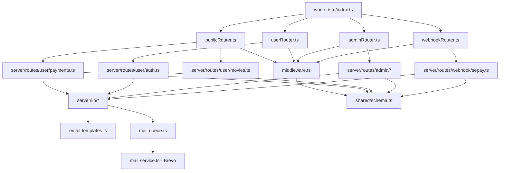
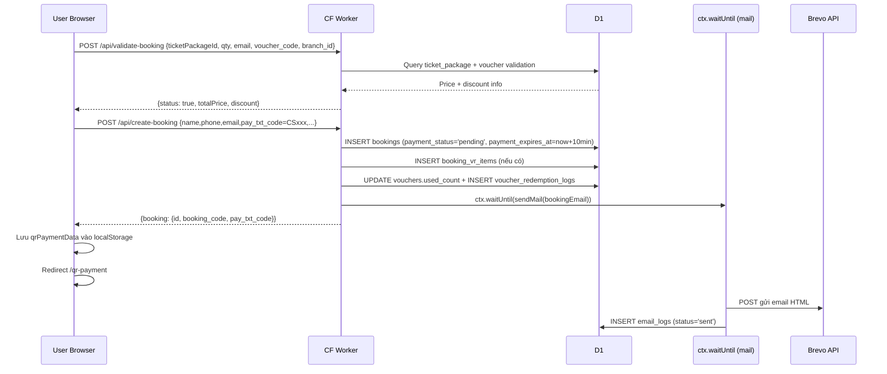
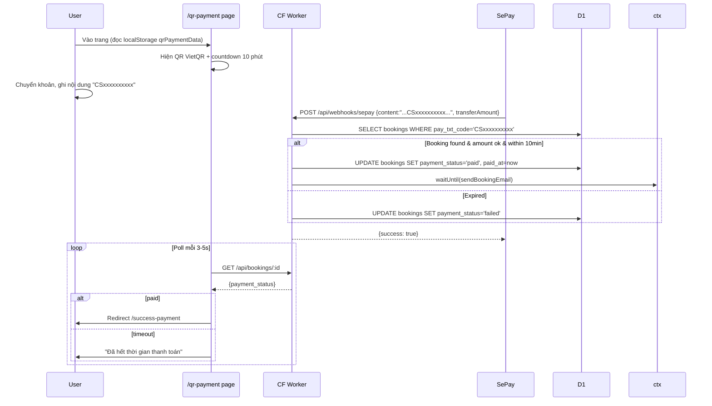
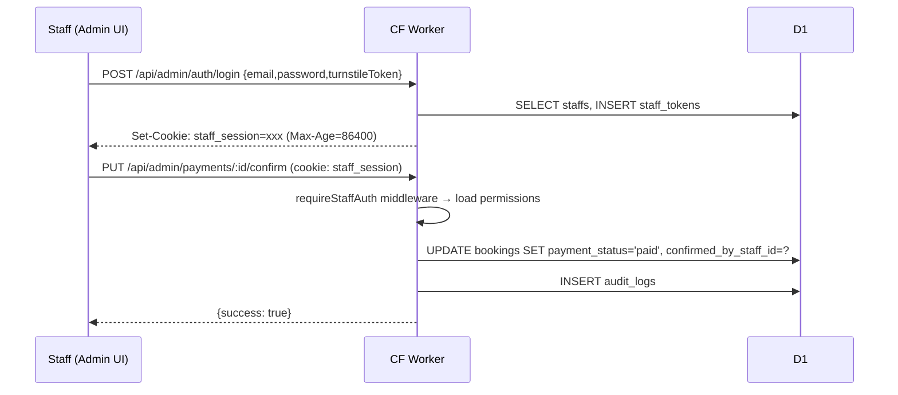
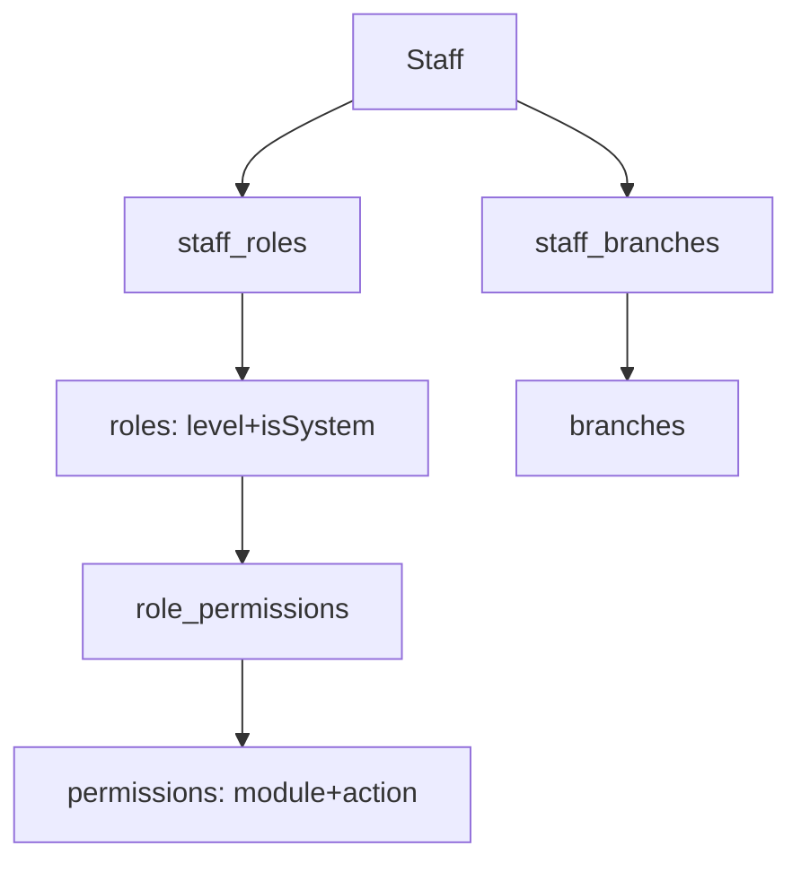
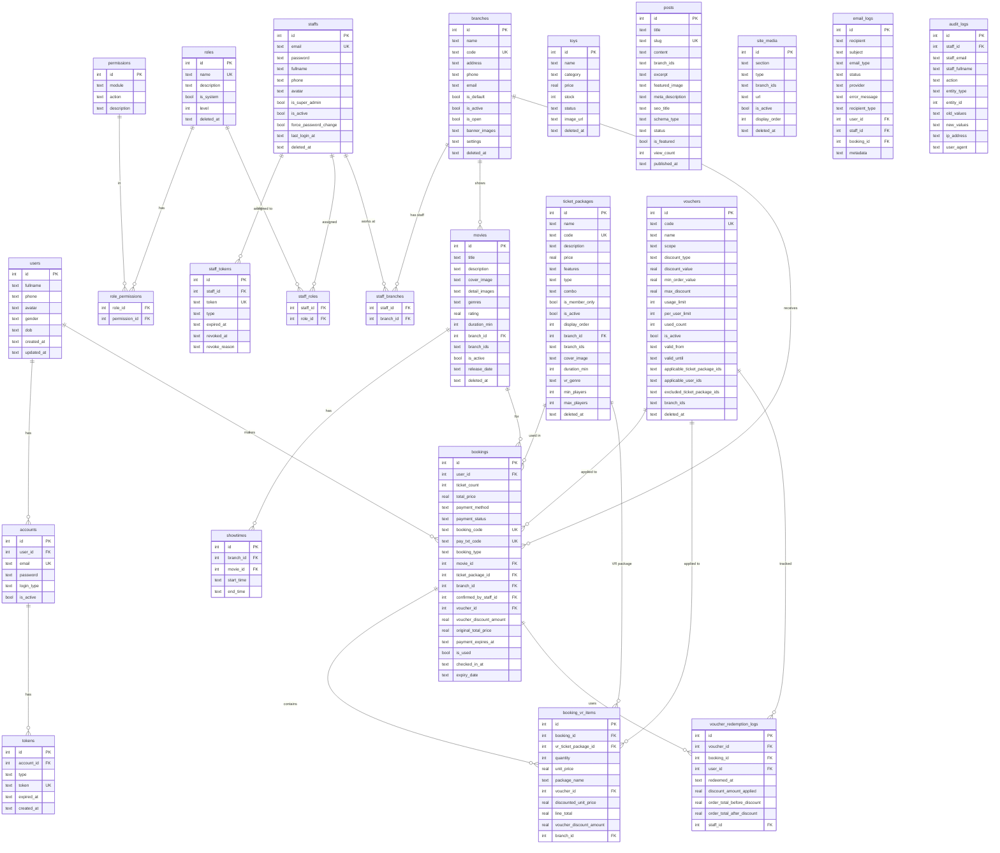

# PROJECT OVERVIEW: CTBooking / Cinesphere

> **Mục đích tài liệu:** Tài liệu kiến trúc để AI hoặc dev đọc vào là hiểu toàn bộ hệ thống.
> **Ngày phân tích:** 2026-09-21
> **Đọc từ code thực tế** — không suy đoán. Phần chưa đọc chi tiết được ghi chú rõ.

---

## 1. TỔNG QUAN DỰ ÁN

### 1.1 Mục đích & Đối tượng

**Cinesphere** là nền tảng đặt vé xem phim 8K và trải nghiệm VR 9D trực tuyến, hỗ trợ đa chi nhánh.

| Đối tượng | Chức năng chính |
|-----------|----------------|
| **Người dùng cuối** | Đặt vé phim, đặt gói VR, áp mã giảm giá, thanh toán VietQR hoặc chờ xác nhận thủ công, xem lịch sử giao dịch |
| **Staff / Admin** | Quản lý phim, suất chiếu, gói vé, booking, thanh toán, doanh thu, chi nhánh, nhân viên (RBAC), voucher, blog, media |

### 1.2 Tech Stack (đọc từ package.json & wrangler.toml)

| Layer | Technology | Version |
|-------|-----------|---------|
| **Backend API** | Cloudflare Workers + Hono | hono@4.11.1 |
| **Database** | Cloudflare D1 (SQLite) | — |
| **ORM** | Drizzle ORM | 0.45.1 |
| **Frontend User** | Next.js App Router (edge runtime) | ~14 (next-client/) |
| **Frontend Admin** | React + Vite SPA | react@18.3.1, vite@7.1.2 |
| **State Management** | TanStack Query v5 + Custom Store | 5.84.2 |
| **Styling** | Tailwind CSS | 3.4.17 |
| **UI Components** | shadcn/ui (Radix UI), Ant Design | antd@6.0.0 |
| **Email** | Brevo (Sendinblue) REST API | — |
| **Media/CDN** | Cloudinary | cloudinary@2.8.0 |
| **Storage** | Cloudflare R2 (bind sẵn, chưa active) | — |
| **Bot Protection** | Cloudflare Turnstile | TURNSTILE_SECRET |
| **Cache** | Cloudflare Cache API (HTTP cache) | — |
| **Settings** | Cloudflare KV (SETTINGS_KV, 2FA config) | — |
| **Build Tool** | Vite (Admin) + next build (User) | 7.1.2 |
| **Runtime** | Cloudflare Workers (edge) | compatibility_date=2024-12-01 |
| **Package Manager** | pnpm | 10.14.0 |
| **Language** | TypeScript | 5.9.2 |
| **Cron** | Cloudflare Workers Cron Trigger | mỗi 5 phút |
| **Form** | react-hook-form + zod | 7.62.0 / 3.25.76 |
| **Rich Text** | CKEditor 5 | 48.0.0 |
| **Animation** | Framer Motion | 12.23.26 |
| **Charts** | Recharts | 2.12.7 |
| **3D/VR Preview** | Three.js + @react-three/fiber | 0.176.0 |
| **Testing** | Vitest | 3.2.4 |

### 1.3 Môi trường Deploy

| Môi trường | URL | Ghi chú |
|-----------|-----|---------|
| **Production Worker** | `cinesphere.com.vn/api/*` | route pattern trong wrangler.toml |
| **Preview Worker** | `cinema-worker-preview.baonhat20.workers.dev` | env=preview, remote D1 |
| **Admin SPA (prod)** | Cloudflare Pages: cinema-admin-pages | build từ `client/` qua Vite |
| **Admin SPA (preview)** | `preview.cinema-pages.pages.dev` | — |
| **User Frontend** | Next.js trên CF Pages | `next-client/` |

---

## 2. CẤU TRÚC THƯ MỤC

### 2.1 Cây thư mục (3 cấp)

```
CTBooking/                              ← Monorepo root (pnpm workspace)
├── package.json                        ← Root scripts: dev, build, deploy, db
├── pnpm-workspace.yaml                 ← {packages: ["next-client"]}
├── wrangler.toml                       ← Root wrangler (legacy, ít dùng)
├── vite.config.ts                      ← Vite config cho Admin SPA (app/)
├── tailwind.config.ts                  ← Tailwind config Admin SPA
├── tsconfig.json                       ← TypeScript root config
├── components.json                     ← shadcn/ui config
│
├── worker/                             ★ BACKEND CHÍNH: Cloudflare Worker
│   ├── wrangler.toml                   ← Config: D1, KV, R2, cron, env vars
│   ├── migrations/                     ← SQL migrations 0001→0015+
│   └── src/
│       ├── index.ts                    ★ Entry point (311 dòng) — gắn 4 sub-routers + CORS + cron
│       ├── middleware.ts               ← requireAuth, requireStaffAuth, requirePermission
│       ├── utils.ts                    ← cloudinary helpers, withCache, logSystemError, token gen
│       └── routes/
│           ├── publicRouter.ts         ← 992 dòng — public endpoints (movies, tickets, booking, posts)
│           ├── userRouter.ts           ← 614 dòng — user auth + profile endpoints
│           ├── adminRouter.ts          ★ 3624 dòng — toàn bộ admin endpoints (80+)
│           └── webhookRouter.ts        ← 72 dòng — SePay webhook tại /api/webhooks/sepay
│
├── shared/                             ★ Types & Schema dùng chung giữa worker và server
│   ├── schema.ts                       ← Drizzle schema: 20 bảng SQLite (577 dòng)
│   ├── api.ts                          ← Shared API types
│   └── booking-invoice.ts             ← Shared invoice types
│
├── server/                             ← Business logic (import từ worker/src/routes/)
│   ├── cloudinary.ts                   ← Cloudinary Express adapter (legacy local)
│   ├── routes/
│   │   ├── mail-service.ts             ← Adapter gửi mail qua Brevo REST API
│   │   ├── admin/                      ← 19 files business logic admin
│   │   │   ├── branches.ts             ← CRUD chi nhánh (22KB)
│   │   │   ├── dashboard.ts            ← Revenue metrics, charts (29KB)
│   │   │   ├── email-logs.ts           ← Xem log email (2.4KB)
│   │   │   ├── email-preview.ts        ← Preview HTML email template (6.5KB)
│   │   │   ├── movies.ts               ← CRUD phim + soft delete (23KB)
│   │   │   ├── payments.ts             ← Xem/tìm giao dịch admin (19KB)
│   │   │   ├── posts.ts                ← CRUD bài viết blog (12KB)
│   │   │   ├── roles.ts                ← CRUD roles & permissions (13KB)
│   │   │   ├── sepay.ts                ← checkSepayTransactionImpl — proxy kiểm tra SePay (2.6KB)
│   │   │   ├── settings.ts             ← getAdminSettingsImpl (KV-based, 0.5KB)
│   │   │   ├── setup.ts                ← Setup superadmin lần đầu (4.5KB)
│   │   │   ├── showtimes.ts            ← CRUD suất chiếu (11KB)
│   │   │   ├── site-media.ts           ← Quản lý banner/video trang chủ (9KB)
│   │   │   ├── staff-auth.ts           ← Login/logout/OTP/2FA staff (17.7KB)
│   │   │   ├── staff-management.ts     ← CRUD nhân viên + RBAC (25.8KB)
│   │   │   ├── tickets.ts              ← CRUD gói vé (29KB)
│   │   │   ├── toys.ts                 ← CRUD sản phẩm phụ (10KB)
│   │   │   ├── users.ts                ← Xem danh sách user (5KB)
│   │   │   └── vouchers.ts             ← CRUD voucher (23.8KB)
│   │   ├── user/                       ← 10 files business logic user
│   │   │   ├── auth.ts                 ← Login, register, OTP validate/resend (13KB)
│   │   │   ├── movies.ts               ← Public movie list (6KB)
│   │   │   ├── password.ts             ← Forget/reset/change password (6KB)
│   │   │   ├── payments.ts             ★ Booking+Payment core (53KB ~1500 dòng)
│   │   │   ├── showtimes.ts            ← Public showtime (1.3KB)
│   │   │   ├── tickets.ts              ← Public ticket packages (3.1KB)
│   │   │   ├── toys.ts                 ← Public toy list (0.3KB)
│   │   │   ├── users.ts                ← User profile, transactions (10.6KB)
│   │   │   ├── vouchers.ts             ← Validate voucher user (16.8KB)
│   │   │   └── vr-bookings.ts          ← VR booking validate + create (13KB)
│   │   ├── webhook/
│   │   │   └── sepay.ts                ← handleSePayWebhookImpl (4.6KB, 137 dòng)
│   │   └── scheduled/
│   │       └── booking-expiry.ts       ← Cron expire booking quá hạn
│   └── lib/                            ← Shared utilities (14 files)
│       ├── audit-logger.ts             ← Ghi audit log staff actions (4.1KB)
│       ├── audit-utils.ts              ← Wrapper wrapper (0.5KB)
│       ├── booking-utils.ts            ← Helpers booking (0.95KB)
│       ├── branch-guard.ts             ← Guard giới hạn staff theo chi nhánh (2.7KB)
│       ├── branch-ids.ts               ← Parse/build branch_ids JSON field (4.4KB)
│       ├── date-utils.ts               ← Date helpers (0.3KB)
│       ├── email-templates.ts          ★ Single source of truth email HTML (40KB)
│       ├── global-settings.ts          ← Load settings từ KV (1.4KB)
│       ├── mail-queue.ts               ← Async mail queue + log vào email_logs (4.7KB)
│       ├── media-utils.ts              ← Media URL utils (1KB)
│       ├── otp-utils.ts                ← OTP generate/validate/delete (11.2KB)
│       ├── rbac-seed.ts                ← Seed roles & permissions (9.5KB)
│       ├── showtime-utils.ts           ← Showtime helpers (0.9KB)
│       └── staff-auth.ts               ← loadStaffPermissions từ DB (2.5KB)
│
├── next-client/                        ★ FRONTEND NGƯỜI DÙNG: Next.js App Router
│   ├── next.config.mjs                 ← Edge runtime, rewrites đến worker
│   ├── wrangler.toml                   ← Deploy lên CF Pages
│   └── src/
│       ├── app/                        ← Next.js App Router pages
│       │   ├── layout.tsx              ← Root layout: font, metadata, providers
│       │   ├── page.tsx                ← Homepage (SSR/ISR)
│       │   ├── booking/page.tsx        ← Trang đặt vé phim (lớn, client component)
│       │   ├── qr-payment/             ← Trang hiển thị QR VietQR + polling
│       │   ├── checkout/               ← (Legacy/Orphan) Checkout page
│       │   ├── success-payment/        ← Xác nhận thanh toán thành công
│       │   ├── account/                ← Profile + lịch sử giao dịch
│       │   ├── vr/                     ← Giới thiệu VR (3D showcase Three.js)
│       │   ├── vr-booking/             ← Booking VR riêng
│       │   ├── bai-viet/               ← Blog / bài viết
│       │   ├── reset-password/         ← Đặt lại mật khẩu
│       │   └── maintenance/            ← Trang bảo trì
│       ├── components/                 ← UI components dùng chung
│       │   ├── LoginDialog.tsx         ← Modal đăng nhập + Turnstile widget
│       │   ├── RegisterDialog.tsx      ← Modal đăng ký + Turnstile widget
│       │   ├── OTPDialog.tsx           ← Modal nhập OTP 2FA
│       │   ├── UserMenu.tsx            ← Dropdown menu user
│       │   └── MovieSchedulePanel.tsx  ← Panel lịch chiếu
│       ├── store/
│       │   ├── cartStore.ts            ← Custom store: localStorage + pub/sub (không dùng Zustand)
│       │   └── movieStore.ts           ← Store phim đang xem
│       ├── hooks/
│       │   ├── useBranch.ts            ← Hook chọn chi nhánh (TanStack Query + cookie)
│       │   ├── useAuth.ts              ← Hook trạng thái đăng nhập
│       │   └── useAuthState.ts         ← Auth state từ cookie/localStorage
│       └── lib/
│           ├── api/                    ← 15 modules API client (fetch wrapper)
│           │   ├── http.ts             ← Fetch wrapper với base URL
│           │   ├── auth.ts             ← Login/register/logout API calls
│           │   ├── booking.ts          ← Booking API calls
│           │   └── payments.ts         ← Payment: validate, create, VR
│           └── cookies.ts              ← getCookie/setCookie/deleteCookie
│
├── client/                             ★ ADMIN SPA: React + Vite
│   └── (pages admin: quản lý phim, vé, staff, voucher, dashboard...)
├── public/                             ← Static assets
├── drizzle/                            ← Drizzle migration output
├── db_backup/                          ← Backup DB SQL files
├── docs/                               ← Tài liệu bổ sung
└── tests/                              ← Vitest integration test files
```

---

## 3. CHI TIẾT TỪNG MODULE

### 3.1 Module: Authentication (User) — `server/routes/user/auth.ts`

| Function | Input | Output | Side Effect |
|---------|-------|--------|------------|
| `loginWithSessionImpl` | email, password, days, SETTINGS_KV | `{user,token}` hoặc `{requires_otp, temp_account_id}` | INSERT session token vào DB; nếu 2FA bật: sinh OTP, gửi email |
| `validateSessionTokenImpl` | token (string) | `{valid, accountId, userId}` | DELETE token nếu expired |
| `validateOTPImpl` | temp_account_id, otp, days | `{user, token}` | DELETE OTP record, INSERT session token |
| `resendOTPImpl` | temp_account_id, email, SETTINGS_KV | `{message}` | Generate OTP mới, gửi email |
| `registerImpl` | email, password, name,... | `{user, emailSent}` | INSERT users+accounts, gửi welcome email qua ctx.waitUntil |

**Dependency:** `otp-utils.ts`, `mail-queue.ts`, `admin/settings.ts` (lấy config 2FA từ KV)

### 3.2 Module: Booking / Payment (User) — `server/routes/user/payments.ts` (53KB)

| Function | Mô tả |
|---------|-------|
| `validateBookingImpl` | Kiểm tra ticket package, tính giá, validate voucher, trả về totalPrice |
| `createPaymentImpl` | INSERT bookings + booking_vr_items + UPDATE voucher usage; enqueue email xác nhận |
| `updatePaymentImpl` | Cập nhật payment_status, paid_at, transaction_id (dùng bởi webhook SePay) |
| `getBookingByIdImpl` | Lấy booking by ID (public, dùng để poll status) |
| `getBookingByCodeImpl` | Tìm booking by booking_code (staff check-in) |
| `confirmUseTicketImpl` | SET is_used=true, checked_in_at=now khi staff quét vé |

### 3.3 Module: VR Booking — `server/routes/user/vr-bookings.ts` (13KB)

| Function | Mô tả |
|---------|-------|
| `validateVRBookingImpl` | Validate từng VR item (type='vr', max_players), tính tổng giá |
| `createVRBookingImpl` | Tạo booking type='vr' + booking_vr_items riêng; gửi email |

### 3.4 Module: SePay Webhook — `server/routes/webhook/sepay.ts` (137 dòng)

Logic xử lý webhook tự động từ SePay:
1. Extract `content` field → regex tìm `CS\d{12}` (pay_txt_code)
2. Query DB tìm booking theo `pay_txt_code`
3. So sánh `transferAmount >= booking.total_price`
4. Kiểm tra payment window (10 phút từ `created_at`)
5. Nếu hợp lệ: gọi `updatePaymentImpl` → set `paid`; nếu quá hạn: set `failed`

**Không có IP whitelist trong code webhook** — bảo vệ thêm bởi Cloudflare WAF (cấu hình riêng).

### 3.5 Module: Admin Staff Auth + RBAC

**`server/routes/admin/staff-auth.ts`** (17.7KB):
- `staffLoginImpl`: bcrypt compare + INSERT staff_tokens; hỗ trợ 2FA OTP email
- `staffVerifyLoginOtpImpl`: Xác thực OTP → tạo session token final
- `staffLogoutImpl`: SET revokedAt trên token
- `staffExtendSessionImpl`: Gia hạn expiredAt token
- `staffChangePasswordImpl`, `staffForceChangePasswordImpl`: Đổi mật khẩu
- `staffRequestPasswordChangeOTP`, `staffChangePasswordWithOTP`: Đổi mật khẩu qua OTP email

**`server/routes/admin/staff-management.ts`** (25.8KB):
- CRUD nhân viên: tạo, cập nhật, soft delete (`deletedAt`), restore
- Gán roles, chi nhánh cho staff
- `resetStaffPasswordImpl`: Admin reset mật khẩu nhân viên khác

**`server/routes/admin/roles.ts`** (13KB):
- CRUD roles và permissions (module + action pairs)
- Gán permissions vào role

### 3.6 Module: Cart Store (Frontend) — `next-client/src/store/cartStore.ts`

Tự implement store thay vì Zustand/Redux:
- **Persistent storage:** `localStorage` với key `cinesphere_cart_items`
- **In-memory cache:** `memoryItemsCache` tránh đọc localStorage nhiều lần
- **Pub/Sub:** `LISTENERS[]` + `DRAWER_LISTENERS[]` thay vì React context
- **Hook:** `useCart()` subscribe vào store, tự re-render khi state thay đổi

### 3.7 Module: Branch Selection — `next-client/src/hooks/useBranch.ts`

Priority chọn chi nhánh: `URL ?branch_id=N` > `Cookie selected_branch_id` > API default branch > first active branch.
- TanStack Query cache 5 phút
- `selectBranch()`: cập nhật đồng bộ Cookie + localStorage + QueryClient + URL

### 3.8 Module: Email — `server/lib/email-templates.ts` (40KB, single source of truth)

| Template function | Kích hoạt khi |
|------------------|--------------|
| `getBookingEmailTemplate` | Tạo booking thành công / SePay xác nhận |
| `getWelcomeEmailTemplate` | Đăng ký tài khoản mới |
| `getResetPasswordEmailTemplate` | Quên mật khẩu user |
| `getOTPEmailTemplate` | User 2FA OTP |
| `getStaffAccountCreatedTemplate` | Admin tạo nhân viên mới |
| `getStaffPasswordResetTemplate` | Reset mật khẩu nhân viên |

**Pipeline gửi mail:** `email-templates.ts` → `mail-queue.ts` (async, log vào email_logs) → `mail-service.ts` (Brevo REST API)

### 3.9 Module: Dashboard — `server/routes/admin/dashboard.ts` (29KB)

| Function | Mô tả |
|---------|-------|
| `getDashboardMetricsImpl` | Tổng booking, doanh thu, user mới, top phim, stats theo chi nhánh |
| `getRevenueByDateImpl` | Revenue theo ngày + bộ lọc |
| `getRevenue7DaysImpl` | Doanh thu 7 ngày gần nhất |
| `getRevenueByMonthImpl` | Doanh thu theo tháng/năm |

### 3.10 Module: Voucher

**`server/routes/admin/vouchers.ts`** (CRUD) + **`server/routes/user/vouchers.ts`** (validate):
- `scope`: `'vr' | 'movie' | 'all'`
- `discount_type`: `'percent' | 'fixed'`
- Giới hạn: `usage_limit`, `per_user_limit`, `valid_from/until`
- Filter theo chi nhánh (`branch_ids`), gói vé cụ thể (`applicable_ticket_package_ids`)
- `validateVoucherForVRImpl`: Tính `discount_amount` thực tế, kiểm tra toàn bộ điều kiện

### 3.11 Dependency Graph



---

## 4. LUỒNG DỮ LIỆU (DATA FLOW)

### 4.1 Luồng đăng nhập User (với Turnstile)

```mermaid
sequenceDiagram
    participant U as User Browser
    participant CF as Cloudflare Turnstile
    participant W as CF Worker (Hono)
    participant DB as D1 SQLite

    U->>CF: Render widget, lấy turnstileToken
    U->>W: POST /api/login {email, password, turnstileToken}
    W->>CF: POST siteverify {secret, response=turnstileToken}
    CF-->>W: {success: true/false}
    alt Turnstile failed
        W-->>U: 403 "Xác minh CAPTCHA thất bại"
    end
    W->>DB: SELECT accounts WHERE email=?
    W->>W: bcrypt.compare(password, hash)
    alt 2FA bật (SETTINGS_KV)
        W->>DB: INSERT tokens (type='otp', expired=5min)
        W-->>U: {requires_otp: true, temp_account_id}
        U->>W: POST /api/validate-otp {temp_account_id, otp}
        W->>DB: SELECT + DELETE token (type='otp')
    end
    W->>DB: INSERT tokens (type='session', expired=30days)
    W-->>U: Set-Cookie: session_token=xxx; HttpOnly; Secure
```

### 4.2 Luồng đặt vé phim



### 4.3 Luồng thanh toán VietQR (SePay Webhook)



### 4.4 Luồng Admin xác nhận thủ công



### 4.5 State Management (Frontend User)

```mermaid
flowchart TD
    A[localStorage: cinesphere_cart_items] --> B[cartStore singleton]
    B --> C[useCart hook]
    C --> D[BookingPage]
    C --> E[CartDrawer]

    F[Cookie: selected_branch_id] --> G[useBranch - TanStack Query 5min]
    G --> D
    G --> H[Header]

    I[Cookie: session_token] --> J[useAuthState hook]
    J --> K[UserMenu]
    J --> L[LoginDialog]

    M[localStorage: qrPaymentData] --> N[/qr-payment]
    M --> O[/success-payment]
```

### 4.6 API Endpoints (đọc từ routers thực tế)

#### Public — không cần auth

| Method | Path | Input | Output |
|--------|------|-------|--------|
| GET | `/api/getActiveMovies` | `?branch_id` | `{activeMovies[]}` |
| GET | `/api/movies` | `?page,pageSize,q,sort,status,branch_id` | `{items[],total}` |
| GET | `/api/movies-detail/:id` | — | Movie object |
| GET | `/api/schedule` | `?branch_id` | Lịch chiếu |
| GET | `/api/tickets` | `?page,branch_id,type,includeInactive` | `{items[]}` |
| GET | `/api/tickets-active` | `?branch_id` | Active ticket packages |
| GET | `/api/tickets/:id` | — | TicketPackage |
| GET | `/api/toys` | `?page,status` | `{items[]}` |
| GET | `/api/toys-active` | — | Active toys |
| GET | `/api/toys/:id` | — | Toy object |
| GET | `/api/site-media` | `?section,type,active` | `{items[]}` (cache 15min) |
| GET | `/api/posts` | `?page,q` | `{items[]}` (published only) |
| GET | `/api/posts/:identifier` | — | Post object |
| POST | `/api/posts/:id/view` | — | Increment view_count |
| GET | `/api/branches` | — | Branch options |
| POST | `/api/validate-booking` | `{ticketPackageId,qty,email,voucher_code,branch_id}` | `{status,totalPrice}` |
| POST | `/api/create-booking` | `{name,phone,email,ticketPackageId,pay_txt_code,...}` | `{booking}` |
| POST | `/api/cancel-booking` | `{payment_id}` | Forces status='failed' |
| GET | `/api/bookings/:id` | — | Booking object |
| POST | `/api/vr-booking/validate` | `{vr_items[],branch_id,voucher_code}` | `{total_price}` |
| POST | `/api/vr-booking/create` | `{name,phone,email,vr_items[],pay_txt_code}` | `{booking}` |
| GET | `/sitemap.xml` | — | XML sitemap |
| GET | `/api/debug/mail` | — | `{ok:true, message:'disabled'}` (disabled) |

#### User Auth Required (cookie: session_token)

| Method | Path | Input | Output |
|--------|------|-------|--------|
| POST | `/api/login` | `{email,password,turnstileToken}` | `{user,token}` hoặc `{requires_otp}` |
| POST | `/api/validate-otp` | `{temp_account_id,otp}` | `{user,token}` |
| POST | `/api/resend-otp` | `{temp_account_id,email,turnstileToken}` | `{message}` |
| POST | `/api/register` | `{email,password,name,phone,gender,dob,turnstileToken}` | `{user}` |
| POST | `/api/forget-password` | `{email,turnstileToken}` | `{message}` |
| POST | `/api/reset-password` | `{token,password}` | `{message}` |
| POST | `/api/logout` | — | Clears session_token cookie |
| GET | `/api/user/profile` | — | `{user,account}` |
| POST | `/api/user/profile` | `{fullname,phone,gender,dob,avatar}` | `{user}` |
| POST | `/api/user/password` | `{oldPassword,newPassword}` | `{message}` |
| GET | `/api/user/transactions` | `?page,status,sort,dir,from,to` | `{items[]}` |

#### Admin (cookie: staff_session) — đọc từ adminRouter.ts

| Method | Path | Permission | Mô tả |
|--------|------|-----------|-------|
| GET/POST | `/api/admin/setup/super-admin` | Public | Kiểm tra/tạo superadmin |
| POST | `/api/admin/auth/login` | Public + Turnstile | Staff login |
| POST | `/api/admin/auth/verify-login-otp` | Public | Xác thực OTP 2FA staff |
| POST | `/api/admin/auth/logout` | Staff | Logout |
| POST | `/api/admin/auth/extend-session` | Staff | Gia hạn session |
| GET | `/api/admin/auth/me` | Staff | Lấy thông tin staff |
| POST | `/api/admin/auth/change-password` | Staff | Đổi mật khẩu |
| POST | `/api/admin/auth/force-change-password` | Staff | Force đổi mật khẩu |
| POST | `/api/admin/auth/forgot-password` | Public | Quên mật khẩu |
| POST | `/api/admin/auth/reset-password` | Public | Reset mật khẩu qua token |
| POST | `/api/admin/auth/request-password-change-otp` | Staff | Yêu cầu OTP đổi mật khẩu |
| POST | `/api/admin/auth/change-password-with-otp` | Staff | Đổi mật khẩu qua OTP |
| GET | `/api/admin/dashboard/metrics` | dashboard:view | Metrics tổng quan |
| GET | `/api/admin/dashboard/revenue-date` | dashboard:view_revenue | Doanh thu theo ngày |
| GET | `/api/admin/dashboard/revenue-7days` | dashboard:view_revenue | Doanh thu 7 ngày |
| GET | `/api/admin/dashboard/revenue-month` | dashboard:view_revenue | Doanh thu theo tháng |
| GET | `/api/admin/revenue` | dashboard:view_revenue | Tổng doanh thu |
| GET | `/api/admin/transactions` | payments:view | Danh sách giao dịch |
| GET | `/api/admin/transactions/:id` | payments:view | Chi tiết booking |
| GET/PUT | `/api/admin/payments/:id/...` | payments:* | Xác nhận/hủy thanh toán |
| GET/POST/PUT/DELETE | `/api/admin/movies/*` | movies:* | CRUD phim |
| GET/POST/PUT/DELETE | `/api/admin/ticket-packages/*` | tickets:* | CRUD gói vé |
| GET/POST/PUT/DELETE | `/api/admin/showtimes/*` | showtimes:* | CRUD suất chiếu |
| GET/POST/PUT/DELETE | `/api/admin/branches/*` | branches:* | CRUD chi nhánh |
| GET/POST/PUT/DELETE | `/api/admin/staff/*` | staff:* | CRUD nhân viên |
| GET/POST/PUT/DELETE | `/api/admin/roles/*` | roles:* | CRUD roles & perms |
| GET/POST/PUT/DELETE | `/api/admin/vouchers/*` | vouchers:* | CRUD voucher |
| GET/POST/PUT/DELETE | `/api/admin/posts/*` | posts:* | CRUD bài viết |
| GET/POST/PUT/DELETE | `/api/admin/site-media/*` | site_media:* | CRUD banner/video |
| GET/POST/PUT/DELETE | `/api/admin/toys/*` | toys:* | CRUD sản phẩm |
| GET | `/api/admin/users` | users:view | Danh sách user |
| GET | `/api/admin/users/:id` | users:view | Chi tiết user |
| GET | `/api/admin/email-logs` | superadmin | Xem log email |
| GET | `/api/admin/audit-logs` | superadmin | Xem audit log |
| POST | `/api/admin/sepay/check` | payments:* | Kiểm tra TK SePay thủ công |
| POST | `/api/admin/booking/:code/use` | tickets:use | Staff quét vé |

#### Webhooks (không có auth HTTP)

| Method | Path | Input | Output |
|--------|------|-------|--------|
| POST | `/api/webhooks/sepay` | SePay JSON body | `{success,message}` |

---

## 5. AUTHENTICATION & AUTHORIZATION

### 5.1 User Authentication

**Đăng nhập thông thường (2FA tắt):**
1. POST `/api/login` — gửi kèm `turnstileToken`
2. Worker xác thực Turnstile qua `siteverify` API
3. `bcrypt.compare(password, accounts.password)`
4. INSERT `tokens` (type=`'session'`, expired=30 days)
5. `Set-Cookie: session_token=xxx; HttpOnly; Secure; SameSite=Lax; Max-Age=2592000`

**Đăng nhập 2FA (khi admin bật trong SETTINGS_KV):**
1. Sau bước 3: kiểm tra `otp_settings.enable_2fa`
2. Nếu bật: INSERT OTP token (type=`'otp'`, expiry configurable), gửi email OTP
3. Response: `{requires_otp: true, temp_account_id}`
4. Client hiện `OTPDialog`, POST `/api/validate-otp`
5. Xác thực OTP → DELETE OTP token → INSERT session token → set cookie

**Middleware `requireAuth`:**
```
Cookie: session_token=xxx
→ Query tokens JOIN với accounts (type='session', expired_at > now)
→ Set c.get('userId'), c.get('accountId')
```

### 5.2 Staff Authentication

Hoàn toàn tách khỏi user auth — dùng bảng `staffs` + `staffTokens`:

1. POST `/api/admin/auth/login` — bắt buộc có `turnstileToken` với `action='admin_login'`
2. `bcrypt.compare(password, staffs.password)`
3. INSERT `staff_tokens` (token=UUID, expiredAt=now+24h)
4. `Set-Cookie: staff_session=xxx; HttpOnly; Secure; SameSite=Lax; Max-Age=86400`

Staff 2FA: tương tự flow user OTP — sử dụng `staffVerifyLoginOtpImpl`.

**Middleware `requireStaffAuth`:**
```
Cookie: staff_session=xxx
→ SELECT staff_tokens JOIN staffs WHERE revokedAt IS NULL AND expiredAt > now AND isActive=true
→ loadStaffPermissions() → load roles, permissions, branchIds
→ Set: staffId, isSuperAdmin, staffPermissions[], staffBranchIds[]
```

### 5.3 RBAC (Role-Based Access Control)



- **Super Admin** (`isSuperAdmin=true`): bypass toàn bộ permission check, thấy mọi chi nhánh
- **Regular Staff**: chỉ thấy data trong `staffBranchIds[]`
- `requirePermission(module, action)`: factory middleware, check `staffPermissions.some(p => p.module===m && p.action===a)`

### 5.4 Route Protection

```
app.use('/api/admin/*', async (c, next) => {
  // Public admin paths: /setup/super-admin, /auth/login, /auth/forgot-password, /auth/reset-password
  if (publicAdminPaths.includes(pathname)) return next();
  return requireStaffAuth(c, next);
});
```

User routes bảo vệ riêng lẻ bằng `requireAuth` middleware trên từng route cần thiết.

---

## 6. XỬ LÝ LỖI & THÔNG BÁO

### 6.1 Error Format Backend (Hono global handler)

```typescript
app.onError((err, c) => {
  return c.json({
    status: 'error',
    message: err.message || 'Internal Server Error',
    stack: isLocal || IS_PREVIEW === 'true' ? err.stack : undefined
  }, 500);
});
```

**Format lỗi chuẩn:**
```json
{ "status": "error", "message": "Mô tả lỗi" }
```

HTTP Status codes được dùng: 200, 400, 401, 403, 404, 409, 410, 500.

**Logging:** `logSystemError(context, error, payload)` trong `utils.ts` — mask fields nhạy cảm trước khi log.

### 6.2 Toast Notifications (Frontend)

- Thư viện: **Sonner** (`sonner@1.7.4`)
- Pattern: `toast.success('msg')` / `toast.error('title', { description: err.message })`
- **Không có global 401 interceptor** — mỗi component tự catch lỗi → không tự động redirect login khi session hết hạn

### 6.3 Rate Limiting & Bot Protection

| Cơ chế | Trạng thái | Phạm vi bảo vệ |
|--------|-----------|----------------|
| Cloudflare WAF Rate Limiting | ✅ Cấu hình ngoài Workers | Sensitive endpoints theo IP/path |
| Cloudflare Turnstile | ✅ Active trong code | login, register, forget-password, resend-otp, admin login |
| KV-based rate limiting | ❌ Đã xóa hoàn toàn | — (gỡ để tránh KV Write Quota) |
| IP whitelist webhook | ❌ Không có trong code | SePay webhook — rely vào WAF |

---

## 7. DATABASE SCHEMA

### 7.1 ERD (Drizzle schema thực tế — `shared/schema.ts`)



### 7.2 Ghi chú quan trọng về Schema

| Quy ước | Chi tiết |
|--------|---------|
| **Datetime** | Lưu chuẩn **UTC ISO 8601** (`YYYY-MM-DDTHH:MM:SS.sssZ`), khi format ra UI luôn convert sang múi giờ `Asia/Ho_Chi_Minh` (độc lập với OS client local time). |
| **JSON fields** | `branch_ids`, `genres`, `features`, `detail_images`, `banner_images`, `settings`, `applicable_*_ids` lưu dạng `TEXT` — parse thủ công ở application layer |
| **`branch_ids = NULL`** | Áp dụng cho tất cả chi nhánh; `"[]"` nghĩa là chưa cấu hình |
| **`booking_type`** | `'movie'` \| `'vr'` — nếu `'vr'` thì có `booking_vr_items` |
| **Soft delete** | `movies`, `ticket_packages`, `vouchers`, `branches`, `staffs`, `roles`, `toys`, `site_media` có `deleted_at` |
| **`ticket_packages`** | Dùng chung cho movie và VR — phân biệt bằng `type` field; VR-specific cols: `vr_genre`, `min_players`, `max_players` |
| **`bookings.pay_txt_code`** | Mã nội dung chuyển khoản `CS + 12 digits`, unique, dùng để đối soát SePay |
| **`email_logs.provider`** | `'brevo'` \| `'mailtrap'` \| `'mailchannels'` \| `'resend'` |
| **`tokens.type`** | `'session'` \| `'otp'` \| `'reset_password'` |
| **`staff_tokens.type`** | `'session'` \| `'otp'` |
| **`bookings.payment_status`** | `'pending'` \| `'paid'` \| `'failed'` \| `'cancelled'` |
| **`bookings.payment_method`** | `'vietqr'` \| `'cash'` |

---

## 8. CẤU HÌNH & MÔI TRƯỜNG

### 8.1 Biến môi trường (đọc từ `worker/wrangler.toml` + runtime bindings)

| Biến | Mục đích | Bắt buộc |
|-----|---------|---------|
| `CLOUDINARY_CLOUD_NAME` | Tên cloud Cloudinary | ✅ |
| `CLOUDINARY_API_KEY` | API key Cloudinary | ✅ |
| `CLOUDINARY_API_SECRET` | API secret Cloudinary | ✅ |
| `CLOUDINARY_UPLOAD_FOLDER` | Thư mục upload | ✅ |
| `BREVO_API_KEY` | API key gửi email qua Brevo | ✅ |
| `BREVO_SENDER_EMAIL` | Email gửi đi (`no-reply@cinesphere.com.vn`) | ✅ |
| `BREVO_SENDER_NAME` | Tên hiển thị (`CINESPHERE`) | ✅ |
| `TURNSTILE_SECRET` | Cloudflare Turnstile secret key | ✅ |
| `SUPER_ADMIN_EMAIL` | Email superadmin bootstrap | ✅ |
| `SUPER_ADMIN_PASSWORD` | Password superadmin — **Cloudflare Secret** (không để trong vars) | ✅ |
| `SUPER_ADMIN_FULLNAME` | Tên superadmin | ✅ |
| `VITE_SERVER_BASE_URL` | Base URL backend API | ✅ |
| `VITE_CLIENT_BASE_URL` | Base URL frontend | ✅ |
| `R2_PUBLIC_BASE` | Base URL public R2 | — |
| `R2_PUBLIC_ENABLED` | Enable R2 public URLs (`"false"`) | — |
| `GMAIL_SENDER_EMAIL` | Gmail sender (có khai báo, backup?) | — |
| `GMAIL_SENDER_NAME` | Gmail sender name | — |
| `INDEXNOW_KEY` | IndexNow SEO key | — |
| `IS_PREVIEW` | Flag preview environment (`"true"`) | — |

**Bindings (Cloudflare):**

| Binding | Type | Mục đích |
|---------|------|---------|
| `cinema_db` | D1 Database | Database chính (prod: `cinema-db`, preview: `cinema-db-preview`) |
| `SETTINGS_KV` | KV Namespace | Lưu cấu hình hệ thống (2FA, OTP settings) |
| `r2_cinemastore` | R2 Bucket | Media storage (bind sẵn, `R2_PUBLIC_ENABLED="false"`) |

**Cron Trigger:** `*/5 * * * *` → `expireStaleBookingsImpl` (tự động expire booking `pending` quá `payment_expires_at`, rollback voucher)

### 8.2 Lệnh chạy hệ thống (đọc từ package.json)

```bash
# Development
npm run dev              # Vite Admin SPA
npm run dev:worker       # wrangler dev --env preview --port 8787
npm run dev:worker:local # wrangler dev --local (SQLite local)
npm run dev:all          # Vite + Wrangler đồng thời (concurrently)

cd next-client && npm run dev  # Next.js dev server

# Build
npm run build            # Build Admin SPA (Vite) → dist/spa/
npm run build:client     # Vite build với VITE_SERVER_BASE_URL production
npm run build:next       # cd next-client && npm run build:cf (CF Pages)

# Deploy
npm run deploy:prod      # wrangler deploy --config worker/wrangler.toml (production)
npm run deploy:preview   # wrangler deploy --env preview (preview env)
npm run pages:deploy:prod    # Build + deploy Admin SPA lên CF Pages (main branch)
npm run pages:deploy:preview # Build + deploy Admin SPA (preview branch)

# Database
npm run db:push          # drizzle-kit push (schema sync)
npm run db:migrate:preview   # wrangler d1 migrations apply --remote --env preview
npm run db:import-local  # Import SQL dump vào D1 local
```

---

## 9. ĐÁNH GIÁ & VẤN ĐỀ ĐÃ NHẬN THẤY

### 9.1 Vấn đề kiến trúc

#### 🔴 Critical: `adminRouter.ts` (3624 dòng, 111KB)
Mặc dù `index.ts` đã được tách thành 4 sub-routers, `adminRouter.ts` vẫn là file cực lớn chứa 80+ route handlers. Nên tách tiếp thành các admin sub-routers theo domain (movies, tickets, payments, staff, roles...).

#### 🔴 Critical: `server/routes/user/payments.ts` (53KB, ~1500 dòng)
Quá nhiều responsibility: validate booking movie, create booking, validate VR booking, create VR booking, confirm use ticket. Nên tách thành: `bookingValidation.ts`, `bookingCreation.ts`, `paymentWebhooks.ts`.

#### ✅ Đã xử lý: Datetime timezone không nhất quán
Tất cả đã theo quy chuẩn đồng bộ: Backend/D1 lưu giờ chuẩn UTC ISO 8601. Frontend (Admin/App) dùng \`Intl.DateTimeFormat\` convert chuẩn xác sang \`Asia/Ho_Chi_Minh\` (không dùng hàm \`getHours()\` thủ công).

#### 🟠 Warning: Không có global 401 interceptor ở frontend
Không có interceptor trung tâm tại `next-client/src/lib/api/http.ts` — mỗi component tự catch lỗi. Khi session hết hạn, user không được redirect về login tự động.

#### 🟠 Warning: `ticket_packages` dùng chung Movie + VR
Bảng có cả cột VR-specific (`vr_genre`, `min_players`, `max_players`) và movie-specific — vi phạm Single Table Inheritance không rõ ràng. Nên tách thành 2 bảng hoặc dùng discriminated union.

#### 🟡 Minor: Hai frontend song song không rõ phân công
`app/` (Vite SPA, Admin) và `next-client/` (Next.js, User) — không có README hoặc comment giải thích phân chia trách nhiệm. `client/` thư mục mục đích không rõ.

#### 🟡 Minor: localStorage lưu dữ liệu nhạy cảm không encrypt
`qrPaymentData` và `pendingOrder` lưu trong localStorage bao gồm tên, phone, email, booking_code. Không encrypt — dễ đọc nếu có XSS.

#### 🟡 Minor: Không có Zod validation cho request body
Phần lớn endpoints không validate request body bằng Zod — chỉ destructure và sử dụng trực tiếp. Dễ gây lỗi runtime khi client gửi sai format.

#### ✅ Đã xử lý: Rate Limiting qua KV
Logic rate limiter KV đã xóa hoàn toàn. Bảo vệ thực hiện qua Cloudflare WAF Rules.

#### ✅ Đã xử lý: God File index.ts
`worker/src/index.ts` đã tách từ 5505 dòng → 311 dòng, 4 sub-routers rõ ràng.

#### ✅ Đã xử lý: Debug routes nguy hiểm
`/api/debug/mail` bị disable (trả về `{ok: true, message: 'Mail debug endpoint disabled'}`) thay vì thực thi.

#### ✅ Đã xử lý: SUPER_ADMIN_PASSWORD
Đã chuyển sang Cloudflare Secret — `wrangler.toml` hiện có comment hướng dẫn `wrangler secret put`, không còn hardcode password.

### 9.2 Code Quality Issues

| Vấn đề | Vị trí | Mức độ |
|--------|--------|--------|
| adminRouter.ts 3624 dòng | `worker/src/routes/adminRouter.ts` | 🔴 |
| payments.ts 53KB, ~1500 dòng | `server/routes/user/payments.ts` | 🔴 |
| Booking page lớn | `next-client/src/app/booking/page.tsx` | 🟡 |
| cartStore.ts tự implement state | `next-client/src/store/cartStore.ts` | 🟡 |
| Thiếu Zod validation body | Tất cả routes | 🟡 |
| localStorage sensitive data | `booking/page.tsx`, `qr-payment` | 🟡 |
| Datetime timezone không nhất quán | Đã được xử lý triệt để | ✅ |
| Không có global API error interceptor | `next-client/src/lib/api/http.ts` | 🟠 |

### 9.3 TODO / Tech Debt còn sót

- `export const attempts = new Map<string, number[]>(); // Removed in-memory map` — comment trong `utils.ts`
- R2 bucket `r2_cinemastore` được bind nhưng `R2_PUBLIC_ENABLED = "false"`, không có code dùng

- `client/` thư mục chứa toàn bộ mã nguồn Admin Vite SPA thực thụ. (Lưu ý lịch sử: Trước đây tài liệu ghi nhầm thư mục `app/` ở root là Admin SPA — đã xác minh lại và sửa chính xác vào ngày 22/09/2026. Thư mục `app/` đã bị xóa bỏ vì là rác/mồ côi của Next.js).

### 9.4 Đề xuất cải thiện (theo thứ tự ưu tiên)

1. **Tách `adminRouter.ts`** thành các domain routers: `adminMoviesRouter`, `adminPaymentsRouter`, `adminStaffRouter`...
2. **Tách `payments.ts`** thành: `bookingValidation.ts`, `bookingCreation.ts`, `paymentWebhooks.ts`
3. **Thêm Zod validation** cho request body ở tất cả endpoints quan trọng
4. **Thêm global 401 interceptor** ở `next-client/src/lib/api/http.ts`
5. ~~**Thống nhất datetime** về ISO 8601~~ (Đã hoàn tất)
6. **Tách `ticket_packages`** thành `movie_packages` và `vr_packages` hoặc dùng discriminated union

8. **Document phân chia frontend** rõ ràng hơn
